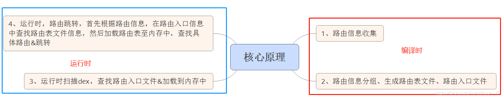

# APP组件化演化
## 康威定律：
"设计系统的架构受制于产生这些设计的组织的沟通结构。"
## 组件化演化
基础模块化->模块化->插件化->进程化
## 设计考虑：
项目功能特点，公司开发人员等
## 整体设计：
* 复用：基础服务，基础组件复用，有差异化组件的复用
* 代码隔离，用project-module-pin来进行代码隔离

## 层次设计划分
## 代码设计
### 生命周期的分发
Lifecycle
### 组件化通信
消息总线可参考我实现的[https://github.com/chaoyueLin/cevnetbus](https://github.com/chaoyueLin/cevnetbus)
### 路由
服务调用Iproider，SPI，全称Service Provider Interfaces，服务提供接口。是Java提供的一套供第三方实现或扩展使用的技术体系。解耦了服务提供与服务使用。
Arouter整体代码设计都是一句这个思想
#### [Arouter](https://github.com/alibaba/ARouter)

* 路由原理，生成路由表Group表。反射构造实例。获取里面的路由添加到warehouse的map,ARouter$$Root$$(moduleName),ARouter$$Group$$(path)
* Provider，默认实现一些依赖注入的服务，也是通过路由找到磊，反射构造实例
* 拦截,也是继承Iproider。一次性全部加载，每次调用navigation其实都会调用拦截器，看是否调用拦截

手写arouter的路由demo可参考[https://github.com/chaoyueLin/routerDemo](https://github.com/chaoyueLin/routerDemo)

拦截器或是引申OKHttp的拦截链[https://github.com/chaoyueLin/okhttpDemo](https://github.com/chaoyueLin/okhttpDemo)

#### WMRouter

### resource
getIdentifier()可获取不同module的资源

避免重复
### R.等静态资源的

webview的插件化更新，资源R的分类型编译
### 提升效率工具，脚本
### AOP面向切面编程(Aspect-Oriented Programming)
* 动态代理
* APT(Annotation Processing Tool 的简称)+JavaPoet
* Transform+ASM